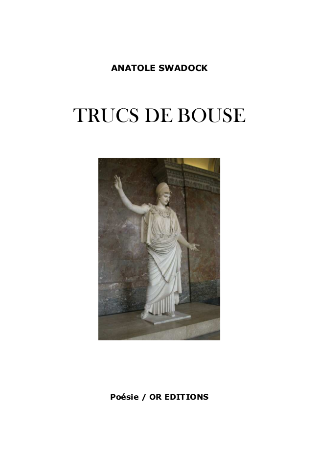

# Anatole Swadock - Trucs de bouse

Extrait de la préface de Gaston-Norbert Ubrab :

*La tâche qui m’a été confiée est relativement difficile comme vous pouvez le deviner. En effet, présenter les oeuvres d’un inconnu est une gageure que dans ce cas, je m’enorgueillis de remplir. Ma qualité d’homme de
lettres, ainsi que ma réputation, pourront, je l’espère, donner un nouvel élan à la notoriété déjà naissante d’Anatole Swadock.*

*La première fois que j’ai rencontré Swadock, dans un bar perdu du cinquième arrondissement, nous étions devant un verre de Guinness. L’éditeur avait voulu organiser cette rencontre afin que je prépare l’écriture d’une
préface aux premières poésies de Swadock intitulées « Trucs de bouse ».*

*Malgré son jeune âge et son manque de qualifications ou de titres littéraires, nous pensons que Swadock s’est tourné précocement vers la poésie. (...)*

[Télécharger le PDF](../pdf/OREditions-OR01-AnatoleSwadock-TrucsDeBouse.pdf)
