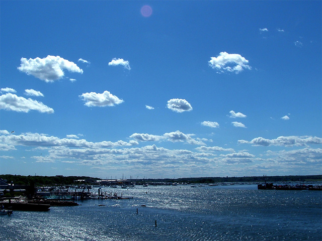

# Etape

La nuit luit de nuées souples venant de l'est 
La moiteur est là dans les lignes géométriques 
Je chante les sirènes qui sirotent dans les criques 
Pendant que pour l'étape je lâche un peu de lest

Je sais ce que je veux et ce que je ne veux plus 
Je conchie ceux qui ont le verbe hasardeux 
Ils peuvent être héritiers mais s'ils sont haineux 
Qu'ils restent dans leur fange et leur torrent de pus

Je fus jadis la victime mesongère 
Le chantre de la fausse vérité 
Celle qui m'a de dedans consumé 
Jusqu'à ce que je mange la réelle terre

Jamais je ne reviendrai dans ces égoûts fumeux 
Dans l'antre de la mouise dans la coulpe battue 
Je la bas depuis lors pour mes travers tortueux 
Refusant d'incarner le tortionnaire qui pue

O Dieu ! que je suis bas et pauvre 
Que mon coeur est sec en comparaison de J. 
Combien de prières devrai-je encore à Marie 
Pour que mon âme misérable ne se sauve

Je regarde le miroir et il me dit reviens 
Fais face à ce vide qui est ton seul destin 
Marche un pas de plus vers le salut réel 
Te courbant toujours plus devant ton Eternel

Je ne fuis plus je suis moi le misérable 
Au pied de l'arbre de vie les racines au ciel 
Je crie dans la tempête les deux pieds dans le sable 
De mes péchés immenses chaotique kyrielle

Mais jamais plus je ne prendrai les péchés d'un autre 
D'un fantasme de jus d'un délire de bonne-femme 
D'une flèche d'amazone prenant l'homme pour l'âne 
Capable d'endosser les blessures vôtres

Que les masques servent à cacher leur misère 
Que les ombres révèlent leurs veines saillantes 
Que les affres surgissent des tombes malveillantes 
Que la chaîne maudite perpétue les hiers

Oui vous étiez folles dans les temps jadis 
A inventer des monstres projetés de vos maux 
Créant de mère en fille l'absurde édifice 
De mensonges et de haine comme un vil fléau

Je conchie votre route et vos folies gerbantes 
Je méprise vos douleurs vos routes défaillantes 
Vos gluantes apnées qui vous lient dans la fange 
Vous suffocantes harpies oubliées des archanges

Vous avez déchaîné des forces pour nuire 
Mais les remous de la mer ne sont pas prévisibles 
Ils dansent en désordre avant la chrysalide 
Qui colle à la branche des verts devenir

Qu'éclose la taille et le bel aujourd'hui 
Qu'explose le feu dans l'arc-en-ciel d'Hermès 
Le double est là qui s'arrime au beau fruit 
Qui ouvre son coeur à la très sainte messe

Les flots ont balayé des générations de névroses 
De folles de mère en fille qui détruisent leurs proches 
Qui sont froides au dedans d'un feu noir qui ose 
Venimer sans réserve ce que leurs crocs accrochent

Je laisse partir les harpies hargneuses 
Qui jacassent de venin gerbant leur bile noire 
Elles restent au loin hantant leurs vomitoires 
Mais le navire vogue vers des vagues heureuses

La nuit luit de nuées souples venant de l'est 
La moiteur est là dans les lignes parallèles 
Je chante le présent aux ridules irréelles 
Tandis que pour l'étape je lâche un peu de lest

*1001nuits, Octobre 2021*

Photo by <a href="https://freeimages.com/photographer/maverick3x-29675">Jeff Golenski</a> from <a href="https://freeimages.com">FreeImages</a>

