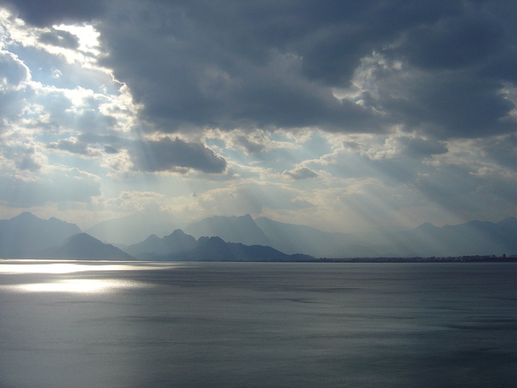

# Prière du soir

Les anciens nous ont quitté 
Leur sagesse a fui les bouches 
Remplacée par des louches 
De sombres banalités

La pression monte 
La division semble régner 
Les individus s'affrontent 
Se creusant des saignées

Ils ont peur de tout de la maladie de la mort 
Du chaud et du froid et du mauvais sort 
Ils vivent dans l'angoisse mais de quoi 
De pouvoir consommer encore sans aller vers toi ?

Dans le chaos éternel de ce monde si laid 
Tu es là Ami, dans les moindres recoins 
Tu as toujours averti les saints 
De ne pas s'attacher à ce qui périssait

Couvre-nous encore de tes divines ailes ! 
Embrasse-nous encore de tes divins baisers ! 
Que la brise de ton souffle éternel nous caresse ! 
Que le parfum de tes voiles vienne nous enlacer !

Tu es Dieu l'Unique le Jeune l'Ancien 
Tout-puissant et porteur de miséricorde 
Transforme en prière notre âme en désordre 
Afin que nous chantions les grâces du Divin !

Englobe-nous dans ton île isolée ô Bien-Aimé 
Où toutes choses et tous êtres t'adressent des louanges 
Où les âmes pâmées chantent avec les anges 
Où la peur n'est plus qu'un passé oublié

Tu es là Ami des moments de solitude 
Faiseur de grâces dans les interstices 
Pour les individus et pour la multitude 
Tu tiens devant nous l'éternel calice

Fais-nous nous souvenir de ta présence présente 
Dans l'instant d'aujourd'hui et dans le maintenant 
Rattrape-nous avant l'horrible descente 
D'un attachement au monde qui blesse terriblement

Fais rencontrer ces âmes pures qui se cachent au grand jour 
Ces merveilleux bijoux polis sur ton métier 
Elles sont venues à toi avides de pitié 
Se prosternant en pleurs débordantes d'amour

Bien-Aimé fais briller ces joyaux emplis de modestie 
Dans les cénacles pieux où l'on loue ton nom 
Fais gonfler les coeurs en demande de pardon 
Sous les reflets moirés de ces âmes pétries

Les chemins du monde sont perdus pour toujours 
Ce sont des dédales vides et d'antiques labyrinthes 
Ils entraînent les égarés puis les éreintent 
Loin des chemins glorieux de tes rayons d'amour

Ce soir je prie pour les anciens qui nous ont quitté 
Pour leur sagesse qui a fui les bouches vides 
Je prie pour les égarés et leurs chemins arides 
Qu'ils reviennent dans la voie que tu nous as tracée

Et je prie surtout pour les coeurs purs 
Pour que tu protèges ceux que tu as ainsi créés 
Faibles ils sont souvent mais débordants de piété 
Protège-les Ami de la souillure

Qu'ils portent du fruit en se développant ! 
Qu'ils chantent tes louanges à leur descendance ! 
Qu'ils portent ta gloire en aimant 
Dans un cercle pieu de chants et de danses !

Louanges à toi ô Très-Haut Ami divin 
Gloire à toi pour l'éternité 
Que ta grâce nous porte aux confins 
De l'amour et de la piété

*1001nuits, Août 2021*

Photo by <a href="https://freeimages.com/photographer/crowpilot-42484">AKIN HOS</a> from <a href="https://freeimages.com">FreeImages</a>

