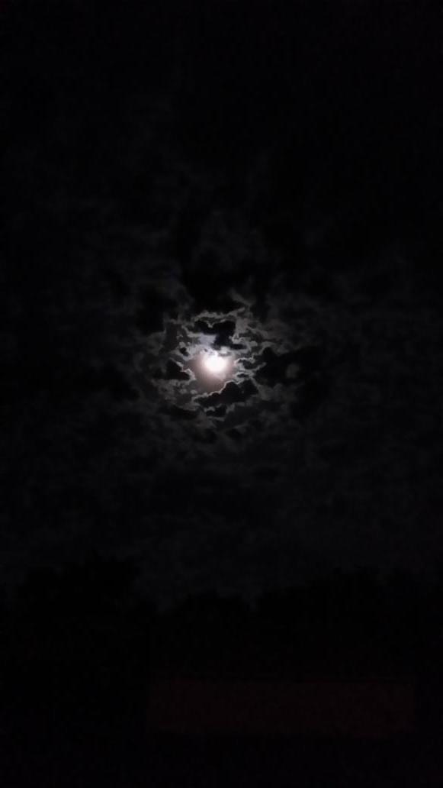

# Waiting For Your Light

Sometimes 
I can do nothing 
But to wait 
For your light

-

Beloved! 
Your inspirations are like lava! 
I can't keep them in my hands! 
And no memory can keep them as they were!

-

The murid in the long path follows many great men's steps!

-

Attachment leads to bad feelings 
For it's a movement from the world to the ego! 
Love! 
Love erases the ego in his movement towards the world!

-

The second suspends! 
You are there my Friend! 
Pour me some more wine! 
For me to get of the ego! 
And take some veils out of 
The Bride face!

I wish I could be a thousand! 
To help the others like saints do! 
But I am a mediocre man! 
In misery when You're not there!

I have no face! 
No name, no age, no memory, Beloved! 
I doesn't mean anything anymore! 
Keep me close!

When something's marvelous, 
There's a short bridge to your truth.

*(Al-Zeituni, August 2014)*
